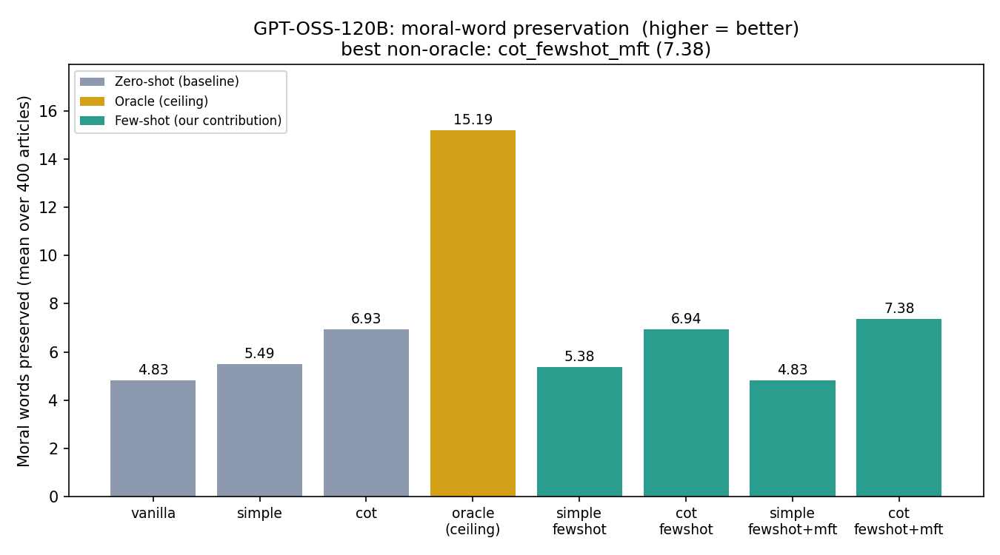
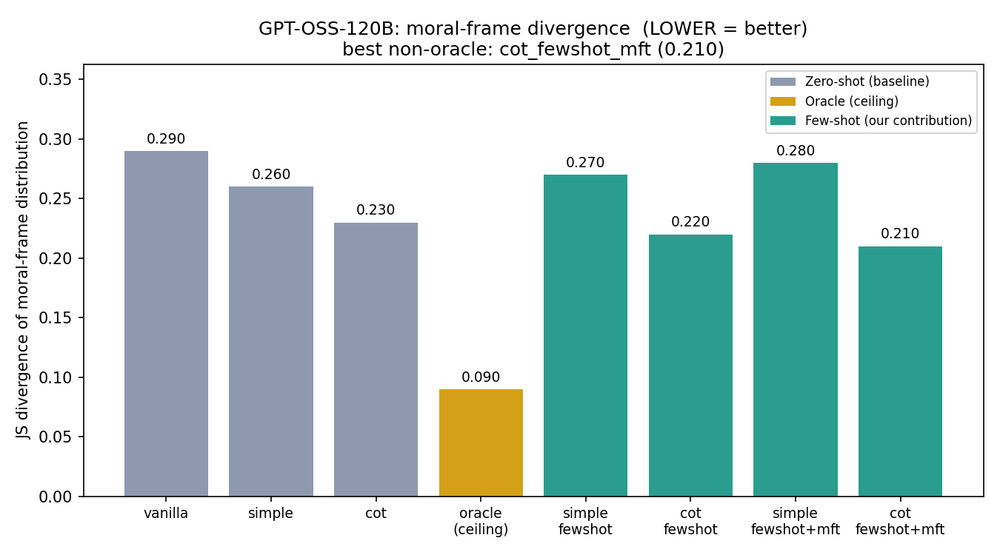
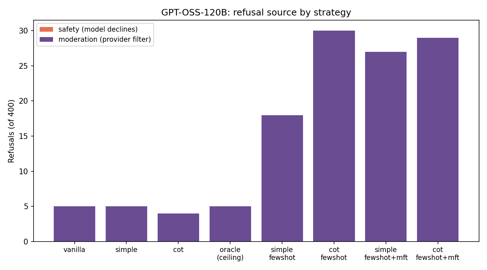
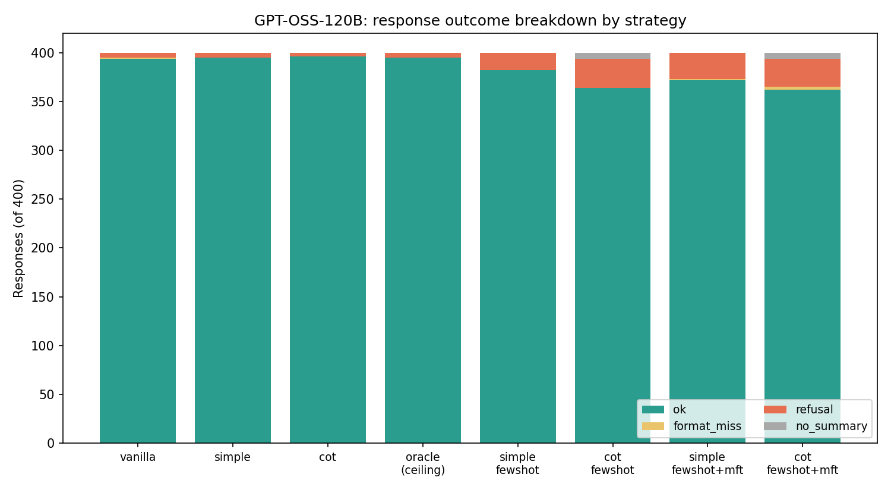
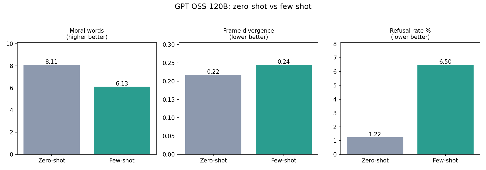
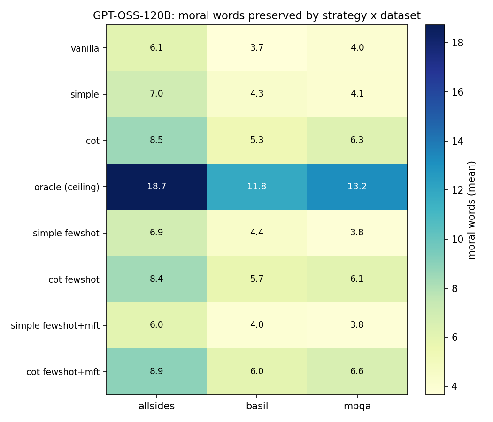
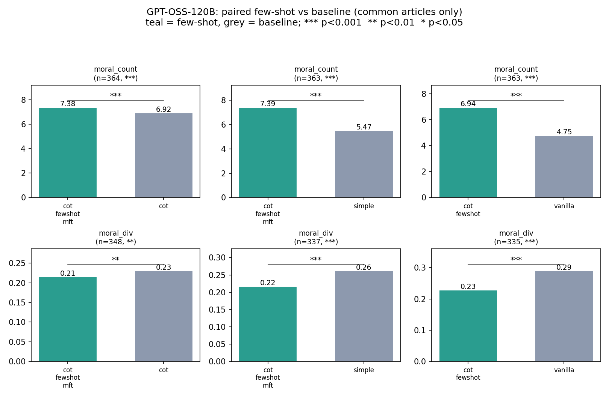

# GPT-OSS-120B evaluation report

Model: GPT-OSS-120B (via OpenRouter, openai/gpt-oss-120b:free)
Test set: 400 EMONA articles (allsides 180, basil 150, mpqa 70), 8 prompting
strategies each = 3,200 responses.

Figures are in `figures/`.

## Metrics

All metrics are computed against the EMONA human moral-word annotations.

- moral_count: how many of the article's annotated moral words appear in the
  summary. Higher = more moral content preserved.
- moral_div: Jensen-Shannon divergence between the moral-foundation distribution
  of the article and of the summary. Lower = the summary keeps the same balance
  of moral foundations as the source.
- length: summary length in tokens (context only, not a quality score).

## Headline results

### Moral-word preservation (moral_count, higher = better)

Best non-oracle strategy is a few-shot CoT variant. Oracle (which injects the
ground-truth moral words) is the ceiling, as expected.

Zero-shot mean: 5.75    Few-shot mean: 6.13  -> few-shot preserves more.

### Moral-frame divergence (moral_div, lower = better)

Best non-oracle: cot_fewshot_mft (0.210). Oracle reaches 0.09.
Zero-shot mean: 0.260    Few-shot mean: 0.245  -> few-shot is closer to the
source moral-foundation balance.

On both moral metrics the few-shot strategies (our contribution) beat the
zero-shot baselines, and the CoT + MFT few-shot variant is the strongest
non-oracle approach.

### Paired (intersection) comparison — the fair version

The per-strategy means above are each averaged over whichever articles that
strategy successfully summarized. Because different strategies refuse / fail to
parse on different articles, those means are over different article sets and are
not strictly comparable. paired_comparison.py restricts to the common set of
articles where every compared strategy produced a usable summary (355 articles
for moral_count, 316 for moral_div), recomputes the means, and runs paired
tests (Wilcoxon signed-rank + paired t-test).

On the common set the few-shot advantage holds and is statistically significant:

  moral_count (higher better), common n=355:
    cot_fewshot_mft 7.37 > cot 6.90 (p<0.001)
    cot_fewshot_mft 7.39 > simple 5.47 (p<0.001)
    cot_fewshot 6.94 > vanilla 4.76 (p<0.001)

  moral_div (lower better), common n=316:
    cot_fewshot_mft 0.214 < cot 0.229 (p<0.01)
    cot_fewshot_mft 0.216 < simple 0.260 (p<0.001)
    cot_fewshot 0.227 < vanilla 0.288 (p<0.001)

Group means on the common set: moral_count zeroshot 5.71 vs fewshot 6.16;
moral_div zeroshot 0.256 vs fewshot 0.246. Few-shot wins both. The numbers are
in paired_comparison.csv.

## Refusals

This is where GPT-OSS differs sharply from the local Llama-3.1 run.

- All 123 refusals are MODERATION refusals (the OpenRouter provider's input
  filter blocked the prompt). ZERO are safety refusals (the model itself never
  produced an "I cannot..." decline).
- Refusal rate is HIGHER for few-shot (6.5%) than zero-shot (1.2%).

The likely mechanism: few-shot prompts embed three full exemplar articles, so
they are roughly 4x longer than zero-shot prompts. That is much more text for
the provider's input moderation to scan, so more prompts get flagged. The
content being flagged is the news material (sensitive topics in allsides/basil),
not anything the few-shot framing adds.

Refusals by dataset: allsides 4.7%, basil 4.4%, mpqa 0.5%. The partisan news
corpora (allsides, basil) trigger far more provider moderation than the
non-partisan mpqa texts.

This is the opposite pattern from Llama-3.1, where refusals were the model's own
safety declines, concentrated on zero-shot cot/oracle, and few-shot eliminated
them. For GPT-OSS the refusals are provider-side and few-shot slightly increases
them. Worth reporting as a model/serving difference, not a prompt-quality one.

## Parse coverage

Format adherence is good across the board (1-9% parse failures). Few-shot CoT
variants have the most format misses (~9%), same pattern as Llama: longer
reasoning outputs sometimes drop the END OF SUMMARY token.

## Data files

See README.txt in this folder for what each CSV contains.
